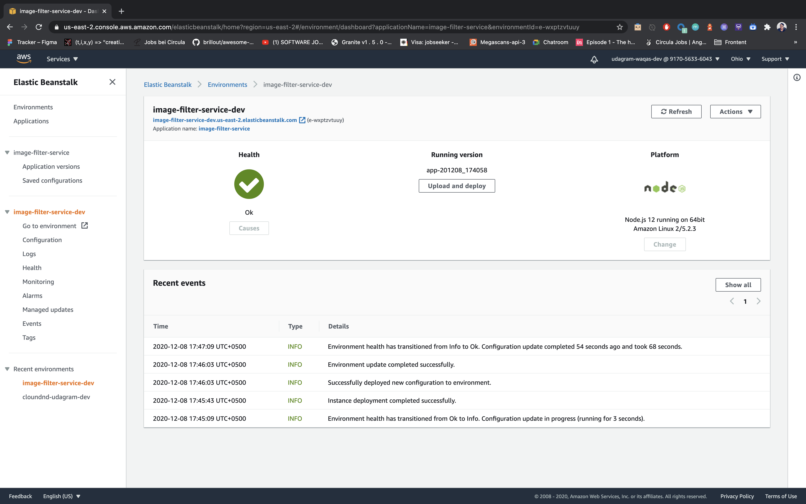

# Udagram Image Filtering Microservice | React Nano Degree project

## Getting Started

### Setup Node Environment

You'll need to create a new node server. Open a new terminal within the project directory and run:

1. Initialize a new project: `npm i`
2. run the development server with `npm run dev`

### Task Check List

1. Added api `filteredimage` :heavy_check_mark:
2. Added JWT Token Support :heavy_check_mark:
3. Pushed to Github :heavy_check_mark:
4. Deployed to `AWS Elastic Beanstalk` :heavy_check_mark:

### How to test

Please import `cloud-cdnd-c2-final.postman_collection.json` to your postman. I have added a valid Auth Token in environment config.

### Deployed System

This system is deployed to aws using `elasticbeanstalk` cli.
I initialized with `eb init`. Then i created new environment using `eb create`. After updating filter service i updated the deployed app using `ep deploy`.

### Envirnoment Screenshot

### Demo Site

[image-filter-service-dev.us-east-2.elasticbeanstalk.com](image-filter-service-dev.us-east-2.elasticbeanstalk.com)
